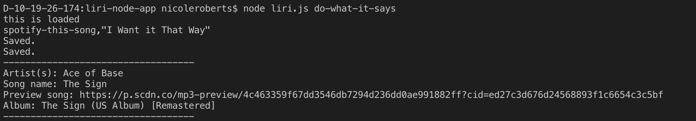

# Project: LIRI Bot

LIRI is a Language Interpretation and Recognition Interface.

* Overview
LIRI is like iPhone's SIRI. However, while SIRI is a Speech Interpretation and Recognition Interface, LIRI is a Language Interpretation and Recognition Interface. LIRI is a command line node app that takes in parameters and gives data in return.

* Purpose of the Project:
The purpose of this project is teach and demonstrate the use of javaScript for back-end server use.

* Challenge
Use Node JS to create a LIRI bot, like iPhone's SIRI, but takes in commands through Language vs Speech using the following commands:

concert-this

spotify-this-song

movie-this

do-what-it-says

* APIs Used:

Spotify (https://developer.spotify.com/)
OMDB (http://www.omdbapi.com)
Bands In Town (http://www.artists.bandsintown.com/bandsintown-api)

* NPM Packages:

Node-Spotify-API (https://www.npmjs.com/package/node-spotify-api)
Axios (https://www.npmjs.com/package/axios)
Moment (https://www.npmjs.com/package/moment)
DotEnv (https://www.npmjs.com/package/dotenv)

* What Each Command Does
LIRI searches Bands in Town for concerts, Spotify for songs, and OMDB for movies.

node liri.js concert-this 

Searches the Bands in Town Artist Events API for an artist and renders the following information about each event to the terminal:

Name of the venue

Venue location

Date of the Event (using the format "MM/DD/YYYY")

node liri.js spotify-this-song 

Displays the following information about the selected song in your terminal/bash window

Artist(s)

The song's name

A preview link of the song from Spotify

The album containing the song

If no song is provided, the program defaults to "The Sign" by Ace of Base.

node liri.js movie-this

This will output the following movie information to your terminal/bash window:

  * Title
  * Year movie was released
  * IMDB Rating
  * Rotten Tomatoes Rating
  * Country where movie was produced
  * Language(s)
  * Plot of the movie
  * Actors in the movie

If the user does not enter a movie selection, the program outputs data for the movie 'Mr. Nobody.'

node liri.js do-what-it-says

Runs spotify-this-song for "I Want it That Way".

